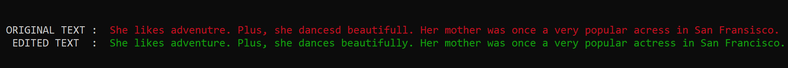
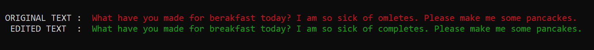

## ABOUT
The project realises a feauture of correcting invalid words in English language using Symmetric Delete Spelling Correction Algorithm. Spelling suggestion is a feature of many computer software applications used to suggest plausible replacements for words that are likely to have been misspelled. This feauture is commonly included in Internet search engines, word processors and spell checkers. 

**Note that the query is checked only for non-word errors. In order to consider real-word errors as well, each token in the query has to be treated as a possible incorrect word.**

## SYMMETRIC DELETE SPELLING CORRECTION ALGORITHM
Any spell checker must have some data about the words in the target language, either in general usage or with specialized knowledge (like medical vocabulary). This can come from:<ul>
<li>A dictionary of all known words.
<li>A text corpus which includes typical text, known to be correctly spelled.
<li>A list of frequently misspelled words, mapping errors to corrections.
</ul>
In this project, only the first two sources of data are used. List of frequently misspelled words is not maintained to reduce any additional look-up instructions.
However such a list, possibly including multi-word phrases, can simply be consulted to see if any of the input words or phrases are present in the list. This functionality can be added depending on the requirements and the nature of input queries. 

To make use of a dictionary without a pre-existing mapping from misspellings to corrections, the typical technique is to calculate the edit distance between an input word and any given word in the dictionary. The Damerau–Levenshtein distance metric considers an "edit" to be the insertion, deletion, transposition or substitution (with another letter) of one letter. Dictionary words that are an edit distance of 1 away from the input word are considered highly likely as corrections, edit distance 2 less likely, and edit distance 3 sometimes included in suggestions and sometimes ignored. 

Because a dictionary of known words is very large, calculating the edit distance between an input word and every word in the dictionary is computationally intensive and thus relatively slow. For a more efficient and practical application, a faster approach can be used to generate all the permutations from an input word of all possible edits. For a word of length n and an alphabet of size a, for edit distance 1 there are at most n deletions, n-1 transpositions, axn alterations, and ax(n+1) insertions. Using only the 26 letters in the English alphabet, this would produce only 54n+25 dictionary lookups, minus any duplicates (which depends on the specific letters in the word). This is relatively small when compared to a dictionary of hundreds of thousands of words. However, tens or hundreds of thousands of lookups might be required for edit distance 2 and greater.

*A further innovation known as SymSpell ("sym" as in "symmetry") can be adopted to speed up the input-time calculation by utilizing the fact that only permutations involving deletions need to be generated for input words if the same deletion permutations are pre-calculated on the dictionary. Therefore, the offline task of producing a hash-table that maps a word (correct or incorrect) to a list of all the words in the vocabulary that can generate that word upon deletion of any one or two letters and pickling that data structure in a binary file to be used in the main program forms the basis of the application.* 

## NOISY CHANNEL MODEL AND CONFUSION MATRICES
The noisy channel model is a framework used in spell checkers, question answering, speech recognition, and machine translation. In this model, the goal is to find the intended word given a word where the letters have been scrambled or contaminated in some manner. A word that was intended to be spelled correctly can be misspelled due to various reasons, like a typing error on keyboard or due to mishearing certain words dictated by a third person. Intuitively, the best replacement for an incorrect word in a query is the word that has the highest probability of getting converted into the incorrect word when passed through the noisy channel. A noisy channel is studied by building a probabilistic model of the errors or noise that can be introduced in a correctly spelled text when passed through the channel. For example, what is the probability that an 'a' in a word is wrongly replaced by an 'e' or an additional 'a' is wrongly appended at the end of a word. Mathematically, the probability that a correct word *w* is converted into an incorrected word *iw* can be calculated based on the probabilities of commiting each of the fundamental errors (insertion, substitution, deletion and transposition) while changing *w* to *iw (HINT: trace the table constructed when the dynamic programming was used to calculate the edit distance between w and iw)* 
The confusion matrices contain the count of the number of times a fundamental error was introduced by the noisy channel.<ul>
<li>DELETION CONFUSION MATRIX (D) - D[x][y] is equal to the number of times the letter y was wrongly deleted after the letter x
<li>INSERTION CONFUSION MATRIX (I) - I[x][y] is equal to the number of times the letter y was wrongly inserted after the letter x
<li>SUBSTITUTION CONFUSION MATRIX (S) - S[x][y] is equal to the number of times the letter y was wrongly substituted by the letter x
<li>TRANSPOSITION CONFUSION MATRIX (T) - T[x][y] is equal to the number of times the fragment xy was wrongly written as yx
</ul>

## MITIGATING SOME PROBLEMS
The vocabulary size is more than 370,000 and hence the total number of distinct words that are produced upon "trimming" each and every word in the vocabulary is huge. It was observed that loading such a heavy file took around 5 minutes at the time of execution. Therefore, to balance the load, the hashtable was distributed among 15 sub-structures that are loaded and then concatenated at the time of execution, hence reducing the net loading time by almost 3 minutes.

The algorithms described so far do not deal well with correct words that are not in the dictionary. Common sources of unknown words in English are compound words and inflections, such as *-s* and *-ing*. These can be accommodated algorithmically, especially if the dictionary contains the part of speech. For simplicity, a dictionary containing not only the morphemes (smallest meaningful units in a language) but also their derivations, inflections and concatenations with other continuous affixes has been used.

Spelling suggestions can also be made more accurate by taking into account more than one word at a time. Multi-word sequences are known as n-grams (where n is the number of words in the sequence). A very large database of n-grams up to 5 words in length is available from Google for this and other purposes. In this project, the best replacement for an incorrect word in the query is chosen on the basis of the words that comes before and after the incorrect word. Since the query is checked for multiple spelling mistakes and correction is done in a sequential order, the word before any incorrect word in the query will always be a valid word in the target language but the word coming after that might not be. In this case, only the preceding word is considered in the n-gram sequence.

Unigram-prior smoothing was used for the bigrams and add-k smoothing (k=0.1 was chosen) for unigrams. All the values in each of the confusion matrices were simply incremented by one to avoid any zeroes in the expression.
